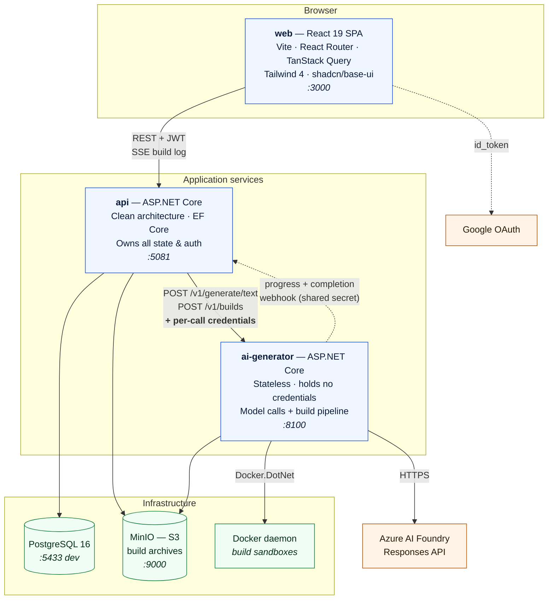
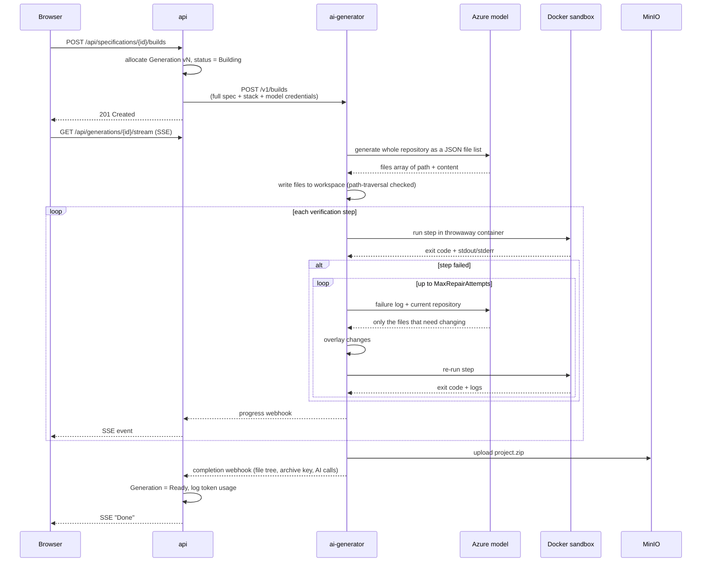
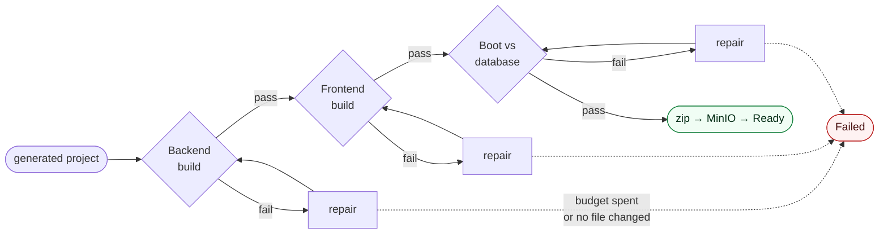
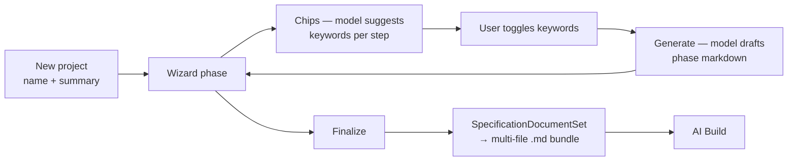
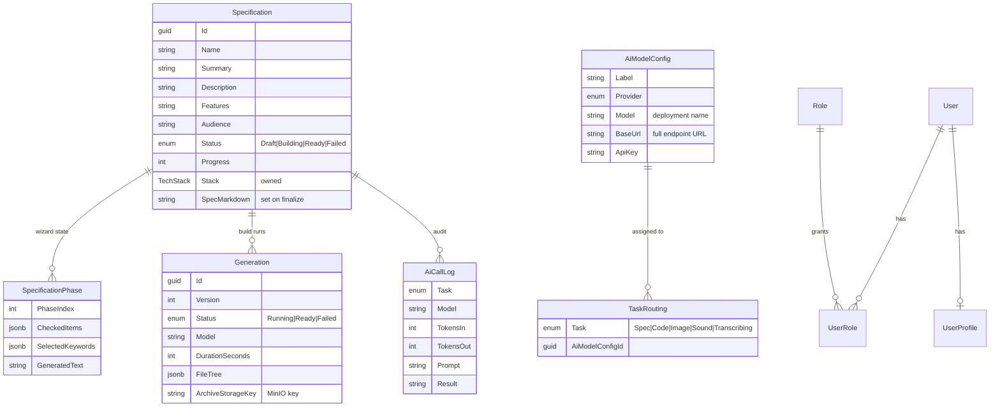

# Vi - AI Studio

Turn a specification into a running project, built by AI.

Vi - AI Studio is a SaaS-style tool with three surfaces:

1. **AI Specification Studio** — a guided wizard that turns a project idea into a structured, multi-file markdown specification, with an AI model suggesting keywords and drafting each phase.
2. **AI Build** — hands that specification to a real model, which generates an entire repository, then **compiles and boots it inside Docker** and feeds every failure back to the model until it actually runs.
3. **Admin** — model/provider configuration, per-task model routing, and a token-level audit log of every AI call.

The defining property: a build is only "done" once the generated backend compiles, the frontend compiles, and the stack boots against a real PostgreSQL database and answers its health endpoint. The artifact you download is one that provably ran — not one that merely looked plausible.

---

## Architecture



### Why the API and AI Generator are split

`ai-generator` is **stateless and credential-free**. It never reads the database and stores no API keys at rest. The `api` resolves which model handles a given task, reads that model's credentials from the `AiModelConfigs` table, and passes them **per request**. This keeps every secret in one place and lets the generator be scaled, sandboxed, or redeployed independently of the data tier.

---

## Components

| Component | Path | Stack | Responsibility |
|---|---|---|---|
| **web** | `apps/web` | React 19, Vite 6, React Router 7, TanStack Query, Tailwind 4, shadcn/base-ui, Zustand | All three UI surfaces. CSR SPA served statically. |
| **api** | `apps/api` | .NET 10, ASP.NET Core Minimal APIs, EF Core, Npgsql | System of record. Auth, specifications, wizard state, generations, model config, audit log. |
| **ai-generator** | `apps/ai-generator` | .NET 10, Docker.DotNet, AWS SDK (S3) | Model invocation, project code generation, sandboxed verification, repair loop, archive upload. |
| **PostgreSQL** | `infra/` | postgres:16-alpine | Relational store; schema owned by EF Core migrations. |
| **MinIO** | `infra/` | minio/minio | S3-compatible store for generated project `.zip` archives. |

### API internal layering (`apps/api/src`)

| Project | Depends on | Contains |
|---|---|---|
| `ViAiStudio.Domain` | — | Entities, `TechStack` value object, `SpecificationPhaseCatalog` |
| `ViAiStudio.Application` | Domain | Command/handler pairs, repository + service interfaces, `SpecificationDocumentSet` |
| `ViAiStudio.Infrastructure` | Application, Domain | EF Core context & repositories, MinIO client, JWT/Google auth, AI Generator HTTP client |
| `ViAiStudio.Api` | Application, Infrastructure | Minimal API endpoints, request/response contracts, exception middleware, DI composition |

---

## The AI Build pipeline

This is the core of the system. A build runs **generate → verify → repair**, looping until the project genuinely works.



### Verification steps — the stop condition

Run in order by `ProjectVerifier`. Each is a disposable container; failure output is fed verbatim to the model.

| Step | Image | Command | Passes when |
|---|---|---|---|
| **Backend build** | `mcr.microsoft.com/dotnet/sdk:10.0` | `dotnet restore && dotnet build -c Release` | compiles clean |
| **Frontend build** | `node:22-alpine` | `npm install && npm run build` | compiles clean |
| **Integration run** | SDK image + `postgres:16-alpine` sidecar on a private network | build, start app, poll health | `GET /health` returns 200 within ~90s |

The integration step is what makes the guarantee meaningful: a real PostgreSQL container comes up on a throwaway Docker network, the generated backend is started against it via `ConnectionStrings__Postgres`, and its health endpoint must answer.



The loop breaks early if a repair round returns **no actual file changes** — re-running an identical workspace would burn tokens on a guaranteed-identical failure.

### The project layout contract

There is no generic way to decide whether a freshly invented project "builds", so `ProjectLayout.Contract` fixes the structure. The same string is embedded in the **generation prompt** and drives the **verifier**, so the two can never drift:

- `backend/` — runnable API host project at the directory root, listens on `8080`, exposes `GET /health`, reads `ConnectionStrings__Postgres`
- `frontend/` — `package.json` whose `build` script succeeds non-interactively
- `docker-compose.yml` and `README.md` at the repository root

### Sandboxing

Generated code is untrusted by construction — it is whatever a model invented. It is **never compiled or executed in the service process**. Every step runs in a throwaway container that is memory-capped (4 GB), bind-mounted only onto its own build workspace, and killed on timeout with partial logs still captured. Model-supplied paths are rejected if absolute or containing `..`, checked twice: once when parsing the reply and again against the resolved path before any file write.

---

## Specification authoring



Phases come from `SpecificationPhaseCatalog` — the server-side source of truth the client renders. **Only phase 1 (Requirements) is currently enabled**; the remaining 14 phases are present but commented out.

Chip generation is deliberately asymmetric for Requirements:

- **Functional Requirements** — prompted from name + summary only, explicitly ignoring the tech stack (what the product *does*).
- **Non-functional Requirements** — prompted with the full stack and implied database schema (technical concerns).

On finalize, `SpecificationDocumentSet` splits each phase's generated markdown into one file per checklist item (e.g. `02-requirements/functional-requirements.md`), falling back to one file per phase when the model didn't use the requested headings.

---

## Data model



---

## Repository layout

```
vi-ai-studio/
├─ apps/
│  ├─ api/                          ASP.NET Core — system of record
│  │  └─ src/
│  │     ├─ ViAiStudio.Domain/          entities, TechStack, phase catalog
│  │     ├─ ViAiStudio.Application/     handlers, interfaces, document set
│  │     ├─ ViAiStudio.Infrastructure/  EF Core, MinIO, auth, generator client
│  │     └─ ViAiStudio.Api/             endpoints, contracts, DI
│  ├─ ai-generator/                 stateless model + build service
│  │  └─ src/ViAiStudio.AiGenerator/
│  │     ├─ Providers/                  AzureFoundryModelProvider
│  │     ├─ Generation/                 ProjectLayout, ProjectCodeGenerator
│  │     ├─ Sandbox/                    DockerSandboxExecutor, ProjectVerifier
│  │     ├─ Builds/                     BuildOrchestrator, BuildWorkspace, queue
│  │     ├─ Callback/                   progress/completion webhooks
│  │     └─ Storage/                    MinIO archive writer
│  └─ web/                          React SPA
│     └─ src/{pages,components,hooks,lib,store}
├─ design/                          design reference prototype + handoff spec
└─ infra/                           docker-compose files, postgres init
```

---

## Running locally

### Prerequisites

.NET 10 SDK · Node 22+ · Docker Desktop (required — AI Build runs containers)

### Recommended: infra in Docker, apps natively

Best for hot reload and debugging.

```bash
# 1. shared infrastructure
docker compose -f infra/docker-compose.dev.yml up -d      # postgres :5433, minio :9000/:9001

# 2. api  (applies EF migrations + seeds the admin role on startup)
dotnet run --project apps/api/src/ViAiStudio.Api          # :5081

# 3. ai-generator
dotnet run --project apps/ai-generator/src/ViAiStudio.AiGenerator   # :8100

# 4. web
cd apps/web && npm install && npm run dev                 # :3000
```

Open <http://localhost:3000>. API docs (Scalar) at <http://localhost:5081/scalar> and <http://localhost:8100/scalar>. MinIO console at <http://localhost:9001> (`minioadmin` / `minioadmin`).

### Everything in Docker

```bash
docker compose -f infra/docker-compose.yml up --build
```

> **AI Build in this mode requires extra setup.** The `ai-generator` container mounts the host Docker socket and runs build sandboxes as *sibling* containers, so bind mounts are resolved by the **host** daemon — a container-local path would mount silently empty. Set `BUILD_WORKSPACE_HOST_PATH` to a real host directory before starting:
>
> ```bash
> BUILD_WORKSPACE_HOST_PATH=/absolute/host/path docker compose -f infra/docker-compose.yml up --build
> ```

### First-run setup

1. Sign in with Google. The admin role is granted to the email seeded in `AuthSeeder.cs`.
2. Go to **Admin → AI model configuration**, add a model, and route it to **Code generation** (and optionally **Spec generation**).
   - For Azure AI Foundry, **Base URL** is the *complete* endpoint including path and `api-version`, e.g. `https://<resource>.cognitiveservices.azure.com/openai/responses?api-version=2025-04-01-preview`, and **Model** is the deployment name.
3. Author a specification in the Studio, finalize it, then **Start AI Build**.

---

## Configuration

### api

| Key | Purpose |
|---|---|
| `ConnectionStrings:Postgres` | Database connection |
| `Storage:ServiceUrl` / `AccessKey` / `SecretKey` / `BucketName` | MinIO |
| `AiGenerator:BaseUrl` | Where to reach ai-generator |
| `AiGenerator:WebhookSecret` | Shared secret for the internal build webhooks |
| `Api:PublicBaseUrl` | URL **ai-generator** uses to call back — must be reachable from that container |
| `Auth:Google:ClientId` | Google OAuth client |
| `Auth:Jwt:*` | Issuer, audience, signing key, expiry |
| `Cors:AllowedOrigins` | Permitted browser origins |

### ai-generator

| Key | Default | Purpose |
|---|---|---|
| `Sandbox:DockerEndpoint` | platform local socket | Docker daemon |
| `Sandbox:WorkspaceRoot` | temp dir | Where build workspaces are written |
| `Sandbox:HostWorkspaceRoot` | = WorkspaceRoot | Same dir **as the daemon sees it** (differs when containerized) |
| `Sandbox:BackendImage` | `mcr.microsoft.com/dotnet/sdk:10.0` | Backend build/run image |
| `Sandbox:FrontendImage` | `node:22-alpine` | Frontend build image |
| `Sandbox:DatabaseImage` | `postgres:16-alpine` | Database sidecar |
| `Sandbox:CommandTimeout` | `00:15:00` | Ceiling on one sandbox command |
| `Sandbox:MaxRepairAttempts` | `4` | Repair rounds per failing step |
| `Storage:*` | — | MinIO (archive upload) |
| `AiGenerator:WebhookSecret` | — | Must match the api's value |

---

## HTTP API

All `/api/*` routes require a bearer JWT unless noted. `/api/admin/*` additionally requires the `Admin` role.

### Auth
| Method | Route | Notes |
|---|---|---|
| `POST` | `/api/auth/google` | Exchange Google `id_token` for a JWT — *anonymous* |
| `GET` | `/api/auth/whoami` | Current user + roles |

### Specifications
| Method | Route |
|---|---|
| `GET` | `/api/specification-phase-catalog` |
| `GET` `POST` | `/api/specifications` |
| `GET` `PATCH` `DELETE` | `/api/specifications/{id}` |
| `PUT` | `/api/specifications/{id}/phases/{phaseIndex}` |
| `POST` | `/api/specifications/{id}/phases/{phaseIndex}/generate` |
| `POST` | `/api/specifications/{id}/phases/{phaseIndex}/chips` |
| `POST` | `/api/specifications/{id}/finalize` |
| `GET` | `/api/specifications/{id}/download` — multi-file `.md` bundle as `.zip` |

### Builds & generated projects
| Method | Route |
|---|---|
| `POST` `GET` | `/api/specifications/{id}/builds` |
| `GET` | `/api/generated-projects` |
| `GET` | `/api/generations/{id}` |
| `GET` | `/api/generations/{id}/download` — project `.zip`, streamed |
| `GET` | `/api/generations/{id}/files?path=…` — single file, for preview |
| `GET` | `/api/generations/{id}/stream` — SSE build log |

### Admin
| Method | Route |
|---|---|
| `GET` `POST` | `/api/admin/ai-configs` |
| `PUT` `DELETE` | `/api/admin/ai-configs/{id}` |
| `GET` | `/api/admin/ai-configs/{id}/reveal` |
| `GET` | `/api/admin/task-routing` · `PUT /api/admin/task-routing/{task}` |
| `GET` | `/api/admin/audit/specifications` · `/{id}` · `/logs/{id}` |

### Internal (shared-secret, not user auth)
`POST /api/internal/builds/{generationId}/events` · `POST /api/internal/builds/{generationId}/complete` — guarded by the `X-Internal-Secret` header.

### ai-generator
`POST /v1/generate/text` · `POST /v1/builds` · `GET /v1/builds/{jobId}` · `GET /health`

---

## Notable design decisions

**Credentials never rest in the generator.** `AiModelConfig` rows live in the api's database; the generator receives them per call and forgets them. Keys are masked in list responses and revealed only through an explicit admin endpoint.

**Downloads are streamed, not redirected.** Browser downloads send an `Authorization` header, which forces a CORS preflight, and the Fetch spec forbids a preflighted request from following a cross-origin redirect. Redirecting to a presigned MinIO URL therefore worked from `curl` but was blocked in the browser, so archives are streamed back through the api instead.

**The full Base URL is posted as-is.** Azure Foundry's path and `api-version` vary per resource and per API surface, so `AzureFoundryModelProvider` POSTs directly to the configured URL rather than reconstructing it from a bare resource root the way the Azure OpenAI SDK does.

**Audit spend is scoped, never summed.** Specification authoring and AI Build bill to different activities, so the two Audit surfaces report separately: `AiCallLog.GenerationVersion` is null for wizard calls and stamped with the build version otherwise, and every audit query takes an `AiCallLogScope` (`specification` / `build` / `all`). Combining them would double-count a specification's cost.

**Progress reporting is best-effort.** A dropped progress webhook logs a warning but never aborts an otherwise-healthy build; only the terminal completion callback is load-bearing.

**Partial artifacts are still archived.** A failed build uploads whatever it produced, so a project that got most of the way is still inspectable rather than silently discarded.

## Known limitations

- Only wizard phase 1 (**Requirements**) is enabled; the other 14 phases are commented out in `SpecificationPhaseCatalog`.
- `AiModelConfig.Provider` is currently **ignored** — every model call is routed to `AzureFoundryModelProvider`. Other providers need their own `IModelProvider` implementation and a dispatcher.
- The spec detail page's file tree (`SPEC_DOC_PATHS`) is a static presentational mock of the eventual 15-phase document set, not the actual bundle contents.
- Build jobs are held in an in-memory queue and store; a generator restart loses in-flight job status (the api still records the generation as `Building`).
- Image, sound, and transcription task routings exist in the model but have no implementation behind them.
