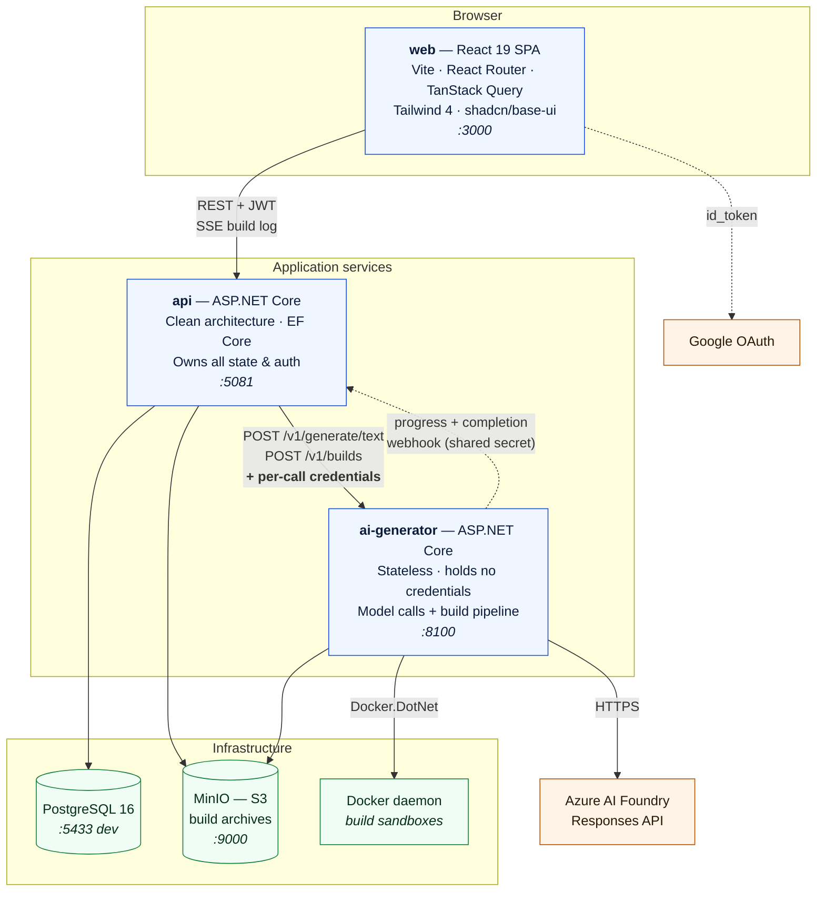
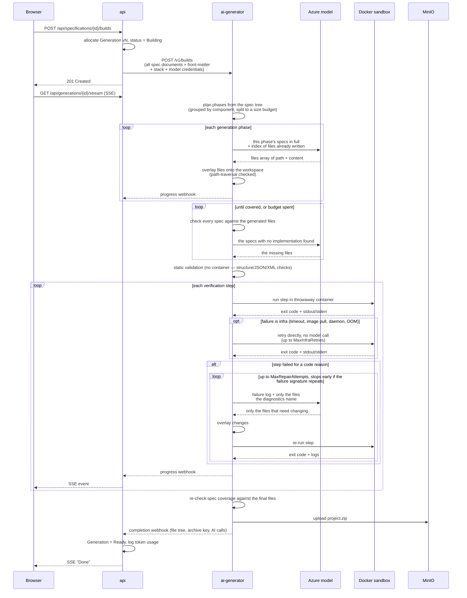
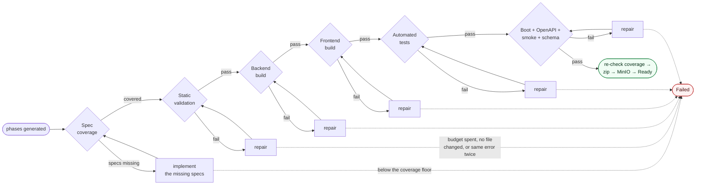

# Vi - AI Studio

Turn a specification into a running project, built by AI.

Vi - AI Studio is a SaaS-style tool with three surfaces:

1. **AI Specification Studio** — a three-stage wizard (chip selection → domain interview → batch generation) that turns a project idea into a full, ID-governed specification tree: product, architecture with ADRs, database entities, per-app backend/frontend specs with endpoints/screens, infrastructure, quality, and delivery — one real file per concern, not a single blob.
2. **AI Build** — hands that specification to a real model, which generates an entire repository, then **compiles and boots it inside Docker** and feeds every failure back to the model until it actually runs.
3. **Admin** — model/provider configuration, per-task model routing, and a token-level audit log of every AI call.

The defining property: a build is only "done" once **every specification is accounted for in the generated code**, the backend compiles, the frontend compiles, the generated test suite passes, and the stack boots against a real PostgreSQL database, answers its health endpoint, exposes a real endpoint in its OpenAPI document, passes a smoke call against that endpoint, and has actually created tables in the database. The artifact you download is one that provably ran and provably implements what was specified — not one that merely looked plausible.

---

## Architecture



### Why the API and AI Generator are split

`ai-generator` is **stateless and credential-free**. It never reads the database and stores no API keys at rest. The `api` resolves which model handles a given task, reads that model's credentials from the `AiModelConfigs` table, and passes them **per request**. This keeps every secret in one place and lets the generator be scaled, sandboxed, or redeployed independently of the data tier.

---

## Components

| Component | Path | Stack | Responsibility |
|---|---|---|---|
| **web** | `apps/web` | React 19, Vite 6, React Router 7, TanStack Query, Tailwind 4, shadcn/base-ui, Zustand | All three UI surfaces. CSR SPA served statically. |
| **api** | `apps/api` | .NET 10, ASP.NET Core Minimal APIs, EF Core, Npgsql | System of record. Auth, specifications, wizard state, generations, model config, audit log. |
| **ai-generator** | `apps/ai-generator` | .NET 10, Docker.DotNet, AWS SDK (S3) | Model invocation, project code generation, sandboxed verification, repair loop, archive upload. |
| **PostgreSQL** | `infra/` | postgres:16-alpine | Relational store; schema owned by EF Core migrations. |
| **MinIO** | `infra/` | minio/minio | S3-compatible store for generated project `.zip` archives. |

### API internal layering (`apps/api/src`)

| Project | Depends on | Contains |
|---|---|---|
| `ViAiStudio.Domain` | — | Entities, `TechStack` value object |
| `ViAiStudio.Application` | Domain | Command/handler pairs per wizard stage, repository + service interfaces, the batch-generation pipeline (`SpecificationGenerationBatchPlanner`, `RunSpecificationGenerationHandler`, `SpecificationBatchResponseParser`, `SpecificationDocumentRenderer`, `ValidateSpecificationDocumentsHandler`, `SpecificationManifestRenderer`) |
| `ViAiStudio.Infrastructure` | Application, Domain | EF Core context & repositories, the prompt-library seeder, the in-process generation queue/worker, MinIO client, JWT/Google auth, AI Generator HTTP client |
| `ViAiStudio.Api` | Application, Infrastructure | Minimal API endpoints, request/response contracts, exception middleware, DI composition |

---

## The AI Build pipeline

This is the core of the system. A build runs **plan → generate in phases → check coverage → verify → repair**, looping until the project genuinely implements the specification and works.

A real specification is far larger than any single model reply can implement — the reference specification under `specification-example/` is ~420,000 characters across 123 documents. Asking for the whole repository in one call produced a thin skeleton that compiled, booted, and ignored almost every document. So the build is generated in **ordered phases**, each carrying its own slice of the specification in full, and the result is then **checked back against every specification** before it is verified.



### Phased generation — why a build isn't one model call

`ProjectBuildPlanner` groups the specification tree into ordered phases by component, then splits any phase whose documents exceed a character budget, so prompt size stays bounded no matter how large the specification grows. Each phase is an independent model call that receives its own specifications **in full**, the product context, and a list of the file paths earlier phases already wrote — paths only, never their contents, so the prompt is bounded by the phase rather than by the accumulated project.

| Phase | Builds from | Produces |
|---|---|---|
| Foundation | `01-architecture/`, `ARCH-`/`ADR-` | Backend host project, Program.cs wiring, conventions, compose, README |
| Database | `02-database/`, `DB-` | Entities, DbContext, configurations, indexes, migrations |
| Backend services | `03-apps/backend/`, `BE-` | Auth, validation, error handling, caching, storage, observability |
| API endpoints | `03-apps/backend/endpoints/`, `API-` | Routes, contracts, validation rules, error codes |
| Frontend | `03-apps/frontend/`, `FE-`/`UI-` | Screens, routing, state, API client, styling |
| Additional services | `03-apps/*`, `SCH-`/`MSG-` | Schedulers, messaging workers |
| Infrastructure | `04-infrastructure/`, `INF-` | Dockerfiles, compose wiring, environment configuration |
| Quality and tests | `05-quality/`, `06-delivery/`, `QA-`/`DEL-` | A test project `dotnet test` discovers and runs |

Phases whose specifications don't exist are dropped rather than prompting the model to invent them, and any document the definitions don't claim still gets its own phase — an unrecognised component is a specification the author wrote and expects implemented, not one to quietly skip. Against the reference specification this plans 9 phases covering all 94 code-bearing documents, with no phase over budget.

Product specs (`00-product/`, `PRD-`/`FR-`/`NFR-`) describe *what* the product must do rather than which files to write, so they ride along with every phase as shared context instead of being a phase of their own. `_meta/` documents — the authoring rules and templates for the specification itself — produce no product code and are excluded.

### Specification coverage — the check that the specs were actually implemented

The Docker steps answer "does this project build and run?". A project implementing three of a hundred specifications passes every one of them happily. `SpecCoverageValidator` closes that gap by looking for evidence of each specification in the generated files:

1. **Declared output paths.** Two thirds of the reference specification's documents carry a `generates:` front-matter list. Because specs are written in their own vocabulary (`src/Infrastructure/Tenancy/**`) while this pipeline mandates a fixed `backend/`+`frontend/` layout, matching uses the *distinctive tail* of the pattern rather than its prefix.
2. **Declared identifiers.** The entity and table names a document backticks in its headings, and the routes it defines. Identifiers derived from document *titles* were tried and removed — they yield generic English ("System", "Schema", "Backup") whose presence in a codebase proves nothing, and they produced every false gap in testing.

Each specification lands in one of three states, and all three are reported rather than collapsed into a single percentage:

| State | Meaning |
|---|---|
| **Implemented** | Evidence found |
| **Missing** | Checkable, and no trace of it exists — this is what the gap-filling loop works on |
| **Unverifiable** | States no paths, entities or routes to look for; counted as not-missing, but reported separately rather than claimed as verified |

Specifications found missing are handed back to the model **in full** — nothing is broken, the work was simply never done, so a failure log would be the wrong prompt. They are asked for in small groups rather than all at once: a gap-filling call told to implement forty specifications in one reply hits exactly the output ceiling that made single-shot generation fail in the first place. When a round closes no gaps the group size is halved instead of the loop giving up, since a smaller ask is a materially easier request.

The threshold is enforced **once, at the very end**, against the files that will actually be shipped — coverage runs again every build round, and failing an intermediate measurement would abandon a project that the next round would have completed.

Decision records are deliberately **generated from but never coverage-checked**: an ADR describes a choice, not a unit of work. Checking them yields guaranteed false gaps and sometimes inverted ones — an ADR titled "React + Vite SPA rather than Blazor" would be reported missing precisely because the code correctly contains no Blazor.

Coverage is measured once after generation and **again against the finished project**, because the repair rounds rewrite files to fix compile and test failures; the coverage measured before they ran is no longer a statement about what is being shipped.

### Verification steps — the stop condition

Run in order by `ProjectStaticValidator` and `ProjectVerifier`. Every step after static validation is a disposable container; failure output is fed back into the repair loop.

| Step | Image | Checks | Passes when |
|---|---|---|---|
| **Static validation** | — (no container) | `.csproj`/`package.json`/frontend JSON configs parse; `ProjectReference`s resolve; packages are version-pinned (or use CPM); `docker-compose.yml`/`README.md` exist | all structural checks pass, in milliseconds, before any container starts |
| **Backend build** | `mcr.microsoft.com/dotnet/sdk:10.0` | `dotnet restore && dotnet build -c Release`, restore cached via a named NuGet volume | compiles clean |
| **Frontend build** | `node:22-alpine` | `npm install && npm run build`, npm cache mounted from a named volume | compiles clean |
| **Automated tests** | SDK image + `postgres:16-alpine` sidecar | discovers every project referencing `Microsoft.NET.Test.Sdk` and runs `dotnet test` on each | a test project exists and every test passes |
| **Integration run** | SDK image + `postgres:16-alpine` sidecar on a private network | build, start app, poll health, fetch the OpenAPI document, smoke-test one non-health endpoint, query `information_schema.tables` directly | health answers within ~90s, the OpenAPI document lists a real endpoint, the smoke call isn't a 5xx, **and** the public schema has at least one table |

The test step runs **only when the specification asked for tests** — that is, when the plan produced a "Quality and tests" phase — so a product whose specification never mentions testing isn't failed for lacking a suite nobody specified. A database sidecar is on its network with the connection string in the environment, so generated tests that exercise real persistence work rather than every one of them having to be a pure unit test.

Static validation catches the boilerplate failures that don't need a container to diagnose — a hallucinated `ProjectReference`, an unversioned `PackageReference`, invalid JSON — for a fraction of the cost of learning the same thing from a failed `dotnet build`.

The integration step is what makes the guarantee meaningful: a real PostgreSQL container comes up on a throwaway Docker network, the generated backend is started against it via `ConnectionStrings__Postgres`, and passing means more than "the process started" — the app has to have created a schema and answer a real request, not just its own health check.



### Persistence — a build doesn't stop at the first failure

Nothing in the pipeline surrenders while it still has budget, because the common case for a generated project is "nearly right", not "unsalvageable". Four separate mechanisms keep a build moving:

| Situation | Old behaviour | What happens now |
|---|---|---|
| A phase's reply is truncated or unparseable | The exception killed the entire build, discarding every phase that had already succeeded | The phase is retried up to `MaxPhaseAttempts`; if it still fails, the build **continues** and the coverage pass picks up its specifications |
| A repair round returns nothing to apply | Gave up on the step immediately | Escalates to sending the whole repository, and only stops after two barren rounds *with* escalation |
| A repair round reproduces the identical failure | Gave up on the step immediately — often after 1 of 4 attempts | Escalates to whole-repository context and spends the remaining budget; a failure surviving a narrowed fix usually lives in a file the log never named |
| A step exhausts its repair budget | The build failed | The whole pipeline re-runs, up to `MaxBuildRounds`, against the files the previous round left behind — the accumulated fixes are kept |

Rounds are what make "close but not finished" recoverable: a project that failed the frontend build in round 1 typically enters round 2 with a compiling frontend and a further-along backend, because every fix applied along the way persists in the workspace.

The one thing that *is* fatal is having nothing to work with — if no phase produced a usable reply at all, there is no project to verify and the build fails immediately rather than running empty containers.

Each `repair` box is itself two layers: an infrastructure retry (Docker timeout, image pull, daemon blip, OOM kill) runs directly against the sandbox with no model call and doesn't touch the budget below, and only a genuine code failure reaches the model. The model-repair loop breaks early if a round returns **no actual file changes**, or if two consecutive rounds land on the **identical failure signature** (same compiler/lint diagnostic codes) — either way, it isn't making progress and shouldn't burn the rest of its budget restating the same fix.

### The project layout contract

There is no generic way to decide whether a freshly invented project "builds", so `ProjectLayout.Contract` fixes the structure. The same string is embedded in the **generation prompt** and drives the **static validator** and **verifier**, so the three can never drift:

- `backend/` — runnable API host project at the directory root, listens on `8080`, exposes `GET /health`, reads `ConnectionStrings__Postgres`, and must call `AddOpenApi()`/`MapOpenApi()` **unconditionally** so its OpenAPI document is served at `/openapi/v1.json` with at least one real, unauthenticated `GET` endpoint besides `/health`
- `frontend/` — `package.json` whose `build` script succeeds non-interactively
- `docker-compose.yml` and `README.md` at the repository root
- the app must create real tables on startup even against an empty database — the pipeline checks `information_schema.tables` directly rather than trusting a 200 from `/health`

### Sandboxing

Generated code is untrusted by construction — it is whatever a model invented. It is **never compiled or executed in the service process**. Every step runs in a throwaway container that is memory-capped (4 GB), bind-mounted only onto its own build workspace, and killed on timeout with partial logs still captured. Model-supplied paths are rejected if absolute or containing `..`, checked twice: once when parsing the reply and again against the resolved path before any file write.

NuGet restore and npm install are backed by named Docker volumes (`vi-ai-nuget-cache`, `vi-ai-npm-cache`) mounted into the build containers, so a repair round — or the next build entirely — doesn't re-download the same packages from a cold container.

---

## Specification authoring

A specification is authored in three stages, each gating the next. The whole flow lives in
`apps/web/src/components/studio/` on the client and `ViAiStudio.Application.Specifications` on the
server; none of it is AI-generated boilerplate strings in C# — the chip groups, interview questions,
authoring rules, ID scheme, per-file templates, and batch instructions are all rows in the
`SpecificationPromptTemplates` table, seeded at startup from plain `.md`/`.json` files under
`apps/api/src/ViAiStudio.Infrastructure/Persistence/PromptLibrarySeedData/` (see `SpecificationPromptLibrarySeeder`).

```mermaid
flowchart LR
    subgraph s1["Stage 1 — Shape"]
        N["New project<br/>name + summary"] --> CH["15 chip groups<br/>(deployables, tenancy,<br/>identity, stack, scope…)"]
        CH --> IS["SpecificationIntakeSheet<br/>+ deterministic conflict rules"]
    end
    subgraph s2["Stage 2 — Interview"]
        IS --> IV["7 rounds, 5 questions each<br/>shown default per question"]
        IV --> IA["SpecificationInterviewAnswer<br/>× round × question"]
        IA -.->|"per-field 'Tighten'"| AI1["model call"]
    end
    subgraph s3["Stage 3 — Generate"]
        IA --> RUN["SpecificationGenerationRun<br/>10 planned batches"]
        RUN --> LOOP["one model call per batch,<br/>in-process background worker"]
        LOOP --> PARSE["parse JSON file list →<br/>render front-matter →<br/>SpecificationDocument rows"]
        PARSE --> SYNC["zip → MinIO,<br/>SSE progress to browser"]
        PARSE --> LOOP
        SYNC --> VAL["validate: duplicate IDs,<br/>dangling deps, cycles,<br/>path collisions"]
        VAL --> MAN["render manifest.md<br/>(never model-written)"]
    end
    MAN --> B["AI Build"]
```



### Stage 1 — chip selection

Fifteen option groups (product shape, tenant isolation, deployables, identity model/features, primary
database, supporting infrastructure, frontend, frontend requirements, functional areas, compliance,
target environments, rigour dial, spec scope, team size), each single- or multi-select with a stated
default — no AI call. Saving computes `ImpliedDecisions`/`ConflictsResolved`/`StillUnknown` via
`IntakeConflictRules`, a small deterministic rule set (e.g. no "scheduler host" deployable ⇒ the
scheduler folder is implied-skipped later; tenant isolation stronger than "single tenant" ⇒
`multi-tenancy` is force-added to the selected functional areas).

### Stage 2 — domain interview

Seven fixed rounds (domain & language, actors & permissions, journeys, invariants, scale, external
systems, operations) of up to five questions each, with the answer defaulting to a shown hint when left
blank. A one-shot **Tighten** button per field sends the raw answer through a model call that returns a
precise rewrite without inventing new facts.

### Stage 3 — batch generation

`SpecificationGenerationBatchPlanner` decides, from the intake sheet, which of ten ordered batches
actually produce files — batch 6 (frontend) is skipped with no `HTTP API`/`web SPA` selection, batch 7
(remaining deployables) is skipped when nothing is left beyond backend/frontend. A run and its (possibly
skipped) batch rows are created up front so the client can render the full plan immediately, then
enqueued on an in-process `Channel`-backed queue (`SpecificationGenerationQueue` +
`SpecificationGenerationQueueWorker`, a `BackgroundService` inside the `api` process — there is no
separate job system for this, since `ai-generator`'s `/v1/generate/text` is already a synchronous,
stateless call and ten sequential calls to it is naturally a loop here).

Each batch assembles one prompt — authoring rules, ID scheme, output shape, per-file rules,
consistency requirements, the relevant per-file templates, the batch's own instructions with
`{{deployables}}`-style placeholders substituted, the rendered intake + interview
(`SpecificationIntakeRenderer`), a compact index of documents already written (path/id/title/depends-on
only, never full content, to bound prompt size), and the IDs already allocated — and asks the model for
one JSON object, `{"files":[...]}`, reusing the exact defensive first-`{`-to-last-`}` parsing
`ai-generator`'s own `ProjectCodeGenerator` already uses for project code, since models routinely wrap
JSON in prose or markdown fences despite instructions. Front-matter is **rendered by the Api from
structured fields**, never trusted as model-authored YAML, which is also what makes the post-run
validation pass (duplicate spec IDs, dangling `depends_on`, dependency cycles, `generates` path
collisions, missing acceptance-criteria sections) a set of plain queries instead of a markdown parse. A
malformed or truncated batch reply is recorded as a `batch-parse-error` validation issue rather than
failing the run — earlier batches' files are never lost. After the last batch, `manifest.md` is
rendered deterministically from every document's front-matter and is **never written by the model**,
since only the Api has a trustworthy view across all ten batches' allocated IDs.

Progress streams to the browser over the same `IBuildEventBroadcaster` SSE mechanism AI Build uses,
just correlated on the run id instead of a `Generation` id.

---

## Data model

```mermaid
erDiagram
    Specification ||--o| SpecificationIntakeSheet : "stage 1"
    Specification ||--o{ SpecificationInterviewAnswer : "stage 2"
    Specification ||--o{ SpecificationGenerationRun : "stage 3 runs"
    SpecificationGenerationRun ||--o{ SpecificationGenerationBatch : "10 planned batches"
    Specification ||--o{ SpecificationDocument : "generated files"
    Specification ||--o{ SpecificationValidationIssue : "post-run findings"
    Specification ||--o{ Generation : "AI Build runs"
    Specification ||--o{ AiCallLog : "audit"
    AiModelConfig ||--o{ TaskRouting : "assigned to"
    User ||--o{ UserRole : has
    Role ||--o{ UserRole : grants
    User ||--o| UserProfile : has

    Specification {
        guid Id
        string Name
        string Summary
        string Description
        string Audience
        enum Status "Draft|Building|Ready|Failed"
        TechStack Stack "owned"
        jsonb DocumentPaths "cached path list"
        string DocumentsArchiveStorageKey "MinIO key"
    }
    SpecificationIntakeSheet {
        string ProductShape
        string TenantIsolation
        jsonb Deployables
        jsonb FunctionalAreas
        string Rigour
        jsonb ImpliedDecisions
        jsonb ConflictsResolved
        datetime CompletedAt
        datetime InterviewCompletedAt
    }
    SpecificationInterviewAnswer {
        int RoundIndex
        int QuestionIndex
        string QuestionText
        string DefaultHint
        string AnswerText
        bool UsedDefault
    }
    SpecificationGenerationRun {
        guid Id
        enum Status "Pending|Running|Ready|Failed"
        string Model
        int DurationSeconds
    }
    SpecificationGenerationBatch {
        int BatchIndex "1-10"
        string Name
        enum Status "Pending|Running|Ready|Skipped|Failed"
        int FilesWritten
        jsonb AllocatedIds
    }
    SpecificationDocument {
        string Path "unique per spec"
        string SpecId "e.g. DB-013"
        string Title
        string Status "draft|ready"
        jsonb DependsOn
        jsonb Generates
        string Content "full file incl. front-matter"
    }
    SpecificationValidationIssue {
        enum Severity "Warning|Error"
        string Code "duplicate-id | dangling-depends-on | …"
        string Message
        string DocumentPath
    }
    SpecificationPromptTemplate {
        string Key "unique, e.g. generation.batch.5"
        enum Stage "ChipSelection|DomainInterview|Generation|Shared"
        string Category
        string Content "markdown or JSON"
        int Version
    }
    Generation {
        guid Id
        int Version
        enum Status "Running|Ready|Failed"
        string Model
        int DurationSeconds
        jsonb FileTree
        string ArchiveStorageKey "MinIO key"
    }
    AiModelConfig {
        string Label
        enum Provider
        string Model "deployment name"
        string BaseUrl "full endpoint URL"
        string ApiKey
    }
    TaskRouting {
        enum Task "Spec|Code|Image|Sound|Transcribing"
        guid AiModelConfigId
    }
    AiCallLog {
        enum Task
        string Model
        int TokensIn
        int TokensOut
        string Prompt
        string Result
    }
```



---

## Repository layout

```
vi-ai-studio/
├─ apps/
│  ├─ api/                          ASP.NET Core — system of record
│  │  └─ src/
│  │     ├─ ViAiStudio.Domain/          entities, TechStack
│  │     ├─ ViAiStudio.Application/     handlers, interfaces, batch-generation pipeline
│  │     ├─ ViAiStudio.Infrastructure/  EF Core, prompt-library seed data, MinIO, auth, generator client
│  │     └─ ViAiStudio.Api/             endpoints, contracts, DI
│  ├─ ai-generator/                 stateless model + build service
│  │  └─ src/ViAiStudio.AiGenerator/
│  │     ├─ Providers/                  AzureFoundryModelProvider
│  │     ├─ Generation/                 ProjectLayout, ProjectCodeGenerator, ProjectStaticValidator,
│  │     │                              DiagnosticFileExtractor, ErrorSignature
│  │     ├─ Sandbox/                    DockerSandboxExecutor, ProjectVerifier
│  │     ├─ Builds/                     BuildOrchestrator, BuildWorkspace, queue
│  │     ├─ Callback/                   progress/completion webhooks
│  │     └─ Storage/                    MinIO archive writer
│  └─ web/                          React SPA
│     └─ src/{pages,components,hooks,lib,store}
├─ design/                          design reference prototype + handoff spec
└─ infra/                           docker-compose files, postgres init
```

---

## Running locally

### Prerequisites

.NET 10 SDK · Node 22+ · Docker Desktop (required — AI Build runs containers)

### Recommended: infra in Docker, apps natively

Best for hot reload and debugging.

```bash
# 1. shared infrastructure
docker compose -f infra/docker-compose.dev.yml up -d      # postgres :5433, minio :9000/:9001

# 2. api  (applies EF migrations + seeds the admin role on startup)
dotnet run --project apps/api/src/ViAiStudio.Api          # :5081

# 3. ai-generator
dotnet run --project apps/ai-generator/src/ViAiStudio.AiGenerator   # :8100

# 4. web
cd apps/web && npm install && npm run dev                 # :3000
```

Open <http://localhost:3000>. API docs (Scalar) at <http://localhost:5081/scalar> and <http://localhost:8100/scalar>. MinIO console at <http://localhost:9001> (`minioadmin` / `minioadmin`).

### Everything in Docker

```bash
docker compose -f infra/docker-compose.yml up --build
```

> **AI Build in this mode requires extra setup.** The `ai-generator` container mounts the host Docker socket and runs build sandboxes as *sibling* containers, so bind mounts are resolved by the **host** daemon — a container-local path would mount silently empty. Set `BUILD_WORKSPACE_HOST_PATH` to a real host directory before starting:
>
> ```bash
> BUILD_WORKSPACE_HOST_PATH=/absolute/host/path docker compose -f infra/docker-compose.yml up --build
> ```

### First-run setup

1. Sign in with Google. The admin role is granted to the email seeded in `AuthSeeder.cs`.
2. Go to **Admin → AI model configuration**, add a model, and route it to **Code generation** (and optionally **Spec generation**).
   - For Azure AI Foundry, **Base URL** is the *complete* endpoint including path and `api-version`, e.g. `https://<resource>.cognitiveservices.azure.com/openai/responses?api-version=2025-04-01-preview`, and **Model** is the deployment name.
3. Author a specification in the Studio — shape it (chips), interview (7 rounds), generate (10 batches) — then, once it's `Ready`, **Start AI Build**.

---

## Configuration

### api

| Key | Purpose |
|---|---|
| `ConnectionStrings:Postgres` | Database connection |
| `Storage:ServiceUrl` / `AccessKey` / `SecretKey` / `BucketName` | MinIO |
| `AiGenerator:BaseUrl` | Where to reach ai-generator |
| `AiGenerator:WebhookSecret` | Shared secret for the internal build webhooks |
| `Api:PublicBaseUrl` | URL **ai-generator** uses to call back — must be reachable from that container |
| `Auth:Google:ClientId` | Google OAuth client |
| `Auth:Jwt:*` | Issuer, audience, signing key, expiry |
| `Cors:AllowedOrigins` | Permitted browser origins |

### ai-generator

| Key | Default | Purpose |
|---|---|---|
| `Sandbox:DockerEndpoint` | platform local socket | Docker daemon |
| `Sandbox:WorkspaceRoot` | temp dir | Where build workspaces are written |
| `Sandbox:HostWorkspaceRoot` | = WorkspaceRoot | Same dir **as the daemon sees it** (differs when containerized) |
| `Sandbox:BackendImage` | `mcr.microsoft.com/dotnet/sdk:10.0` | Backend build/run image |
| `Sandbox:FrontendImage` | `node:22-alpine` | Frontend build image |
| `Sandbox:DatabaseImage` | `postgres:16-alpine` | Database sidecar |
| `Sandbox:CommandTimeout` | `00:15:00` | Ceiling on one sandbox command |
| `Sandbox:MaxRepairAttempts` | `4` | Model repair rounds per failing step (only spent on genuine code failures) |
| `Sandbox:MaxBuildRounds` | `3` | Re-runs of the whole coverage+verification pipeline after a step exhausts its repair budget |
| `Sandbox:MaxPhaseAttempts` | `3` | Retries of one generation phase whose reply was unusable (truncated/unparseable JSON) |
| `Sandbox:MaxCoverageAttempts` | `3` | Rounds spent implementing specifications the coverage check found missing |
| `Sandbox:MinimumSpecCoveragePct` | `90` | Share of specifications that must not be missing for a build to pass |
| `Sandbox:MaxInfraRetries` | `2` | Direct retries per step for infra failures (timeout/image pull/daemon/OOM) — no model call |
| `Sandbox:InfraRetryDelay` | `00:00:05` | Delay between infra retries |
| `Sandbox:NugetCacheVolume` | `vi-ai-nuget-cache` | Named Docker volume caching the NuGet global-packages folder |
| `Sandbox:NpmCacheVolume` | `vi-ai-npm-cache` | Named Docker volume caching npm's package cache |
| `Storage:*` | — | MinIO (archive upload) |
| `AiGenerator:WebhookSecret` | — | Must match the api's value |

---

## HTTP API

All `/api/*` routes require a bearer JWT unless noted. `/api/admin/*` additionally requires the `Admin` role.

### Auth
| Method | Route | Notes |
|---|---|---|
| `POST` | `/api/auth/google` | Exchange Google `id_token` for a JWT — *anonymous* |
| `GET` | `/api/auth/whoami` | Current user + roles |

### Specifications
| Method | Route |
|---|---|
| `GET` `POST` | `/api/specifications` |
| `GET` `PATCH` `DELETE` | `/api/specifications/{id}` |
| `GET` | `/api/specifications/{id}/documents` — path list, backs the file tree |
| `GET` | `/api/specifications/{id}/documents/content?path=…` — one file, for preview |
| `GET` | `/api/specifications/{id}/download` — the generated tree as `.zip`, streamed from MinIO |
| `GET` | `/api/specifications/{id}/validation-issues` |

### Specification intake — stage 1 (chips) and stage 2 (interview)
| Method | Route |
|---|---|
| `GET` | `/api/specifications/{id}/intake/` — the intake sheet, or `null` before the first save |
| `GET` | `/api/specifications/{id}/intake/chip-groups` — the 15 option groups |
| `PUT` | `/api/specifications/{id}/intake/chips` |
| `GET` | `/api/specifications/{id}/intake/interview-rounds` — the 7 round definitions |
| `GET` | `/api/specifications/{id}/intake/interview-answers` |
| `PUT` | `/api/specifications/{id}/intake/interview/{roundIndex}` |
| `POST` | `/api/specifications/{id}/intake/interview/expand` — the "Tighten" AI helper |
| `POST` | `/api/specifications/{id}/intake/complete` |

### Specification generation — stage 3 (batches)
| Method | Route |
|---|---|
| `POST` `GET` | `/api/specifications/{id}/generation-runs` |
| `GET` | `/api/specifications/{id}/generation-runs/{runId}` |
| `GET` | `/api/specifications/{id}/generation-runs/{runId}/stream` — SSE batch progress |

### Builds & generated projects
| Method | Route |
|---|---|
| `POST` `GET` | `/api/specifications/{id}/builds` |
| `GET` | `/api/generated-projects` |
| `GET` | `/api/generations/{id}` |
| `GET` | `/api/generations/{id}/download` — project `.zip`, streamed |
| `GET` | `/api/generations/{id}/files?path=…` — single file, for preview |
| `GET` | `/api/generations/{id}/stream` — SSE build log |

### Admin
| Method | Route |
|---|---|
| `GET` `POST` | `/api/admin/ai-configs` |
| `PUT` `DELETE` | `/api/admin/ai-configs/{id}` |
| `GET` | `/api/admin/ai-configs/{id}/reveal` |
| `GET` | `/api/admin/task-routing` · `PUT /api/admin/task-routing/{task}` |
| `GET` | `/api/admin/audit/specifications` · `/{id}` · `/logs/{id}` |

### Internal (shared-secret, not user auth)
`POST /api/internal/builds/{generationId}/events` · `POST /api/internal/builds/{generationId}/complete` — guarded by the `X-Internal-Secret` header.

### ai-generator
`POST /v1/generate/text` · `POST /v1/builds` · `GET /v1/builds/{jobId}` · `GET /health`

---

## Notable design decisions

**Credentials never rest in the generator.** `AiModelConfig` rows live in the api's database; the generator receives them per call and forgets them. Keys are masked in list responses and revealed only through an explicit admin endpoint.

**Downloads are streamed, not redirected.** Browser downloads send an `Authorization` header, which forces a CORS preflight, and the Fetch spec forbids a preflighted request from following a cross-origin redirect. Redirecting to a presigned MinIO URL therefore worked from `curl` but was blocked in the browser, so archives are streamed back through the api instead.

**The full Base URL is posted as-is.** Azure Foundry's path and `api-version` vary per resource and per API surface, so `AzureFoundryModelProvider` POSTs directly to the configured URL rather than reconstructing it from a bare resource root the way the Azure OpenAI SDK does.

**Audit spend is scoped, never summed.** Specification authoring and AI Build bill to different activities, so the two Audit surfaces report separately: `AiCallLog.GenerationVersion` is null for wizard calls and stamped with the build version otherwise, and every audit query takes an `AiCallLogScope` (`specification` / `build` / `all`). Combining them would double-count a specification's cost.

**Progress reporting is best-effort.** A dropped progress webhook logs a warning but never aborts an otherwise-healthy build; only the terminal completion callback is load-bearing.

**Partial artifacts are still archived.** A failed build uploads whatever it produced, so a project that got most of the way is still inspectable rather than silently discarded.

**A build is phased because a specification doesn't fit in a reply.** Input context was never the binding constraint — output was. One call asking for a whole repository against a 420,000-character specification returns a plausible skeleton, because that is all that fits. Phasing trades one call for roughly a dozen and makes complete implementation reachable; coverage checking is what makes it verifiable, since a model can silently skip a specification inside a phase and nothing downstream would notice.

**Coverage evidence is structural, not semantic.** Matching declared paths and declared identifiers cannot prove an implementation is *correct* — the generated tests and the integration run are what argue for correctness. It reliably catches the failure this pipeline actually suffered from, which is a specification never being implemented at all, and it does so without a model call.

**Infra failures don't spend a repair attempt.** `DockerSandboxExecutor` classifies *why* a step failed — timeout, image pull, daemon unreachable, OOM kill (exit 137), or a genuine non-zero exit — and only the last of those reaches the model. Asking an LLM to "fix" a container timeout is nonsensical and was previously burning both a repair attempt and an LLM call on a problem the code can't fix.

**Repair prompts are diagnosed, not just retried.** `DiagnosticFileExtractor` parses `path(line,col)`-shaped locations out of dotnet/tsc/eslint output and narrows the repair prompt to just the files actually named (plus manifests like `.csproj`/`package.json`), falling back to the whole project only when nothing parses. `ErrorSignature` fingerprints a failure by its diagnostic codes so two repair rounds landing on the identical error stop the loop instead of exhausting the budget re-describing a fix that isn't landing.

## Known limitations

- `AiModelConfig.Provider` is currently **ignored** — every model call is routed to `AzureFoundryModelProvider`. Other providers need their own `IModelProvider` implementation and a dispatcher.
- Specification coverage is judged on structural evidence, so a specification whose vocabulary doesn't survive into code can be reported missing when it was in fact implemented (and, less often, the reverse). This is why the pass threshold is `MinimumSpecCoveragePct` rather than a flat 100%, and why "unverifiable" is reported as its own state instead of being counted as success.
- Build phases run sequentially, one model call each. A large specification therefore takes roughly a dozen calls before verification even starts, and the phases are not resumable — an `ai-generator` restart mid-build loses the work.
- Persistence costs time and tokens. A build that needs all three rounds runs every verification step three times, including the Docker-backed ones, so a struggling build is substantially slower and more expensive than a clean one. Lower `MaxBuildRounds` if you would rather fail fast than keep trying.
- A stage-3 batch's JSON file-list reply is occasionally truncated by the model before it closes (seen most on the larger batches — backend, database). This is recorded as a `batch-parse-error` validation issue rather than failing the run, and every other batch's files are unaffected, but the batch itself yields 0 files until re-run. Worth revisiting if it turns out to be a `max_tokens`-shaped problem on the provider side.
- The stage-3 batch loop runs entirely inside the `api` process against `ai-generator`'s stateless `/v1/generate/text`, one batch at a time, on an in-memory `Channel`-backed queue — an `api` restart mid-run loses that in-flight run's progress (the run stays `Running` in the database; it isn't resumed automatically).
- Build jobs (AI Build, the separate `ai-generator` pipeline) are held in an in-memory queue and store; a generator restart loses in-flight job status (the api still records the generation as `Building`).
- Image, sound, and transcription task routings exist in the model but have no implementation behind them.
